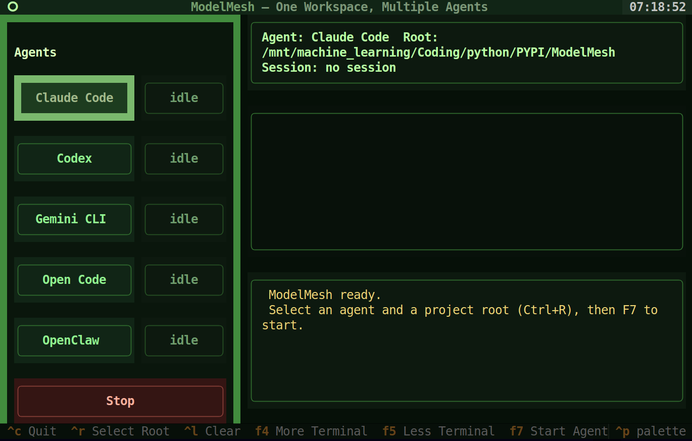
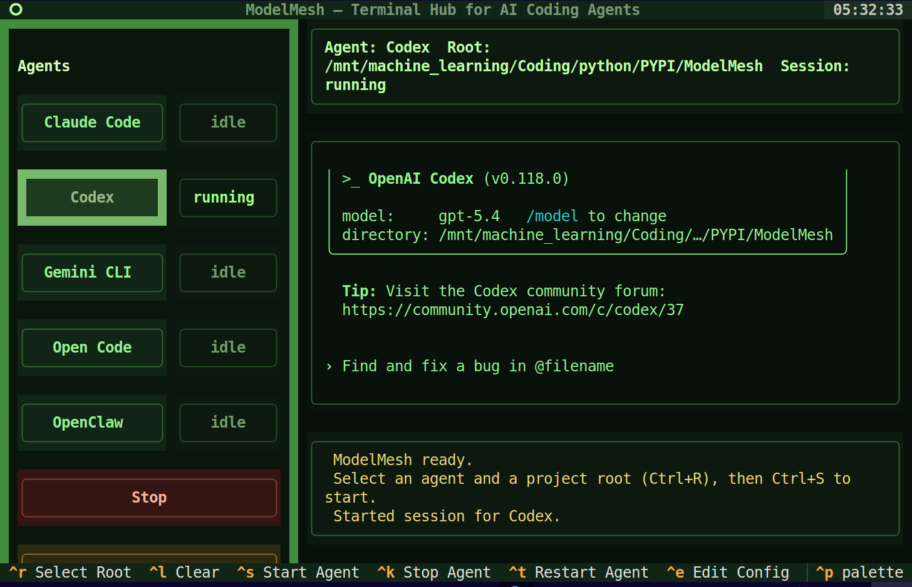
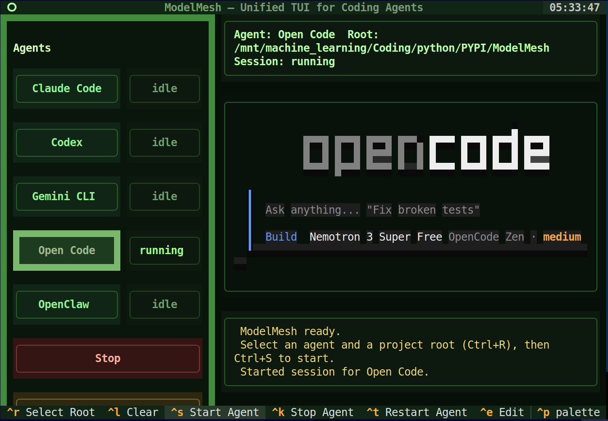
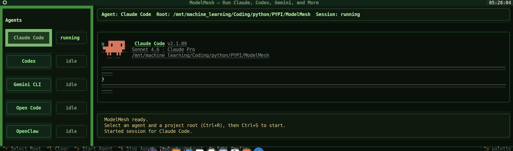

# ModelMesh



ModelMesh is a Textual-based terminal UI for running and switching between multiple coding-agent CLIs from one project workspace.

It currently supports:

- Claude Code
- Codex
- Gemini CLI
- Open Code
- OpenClaw

Each agent gets its own session state, and the active agent can be started, stopped, restarted, and interacted with directly from the TUI.

## What It Does

- Shows a left sidebar with available agents and live session-state badges
- Lets you switch the active agent without leaving the app
- Starts each agent inside a PTY so terminal-style output is preserved
- Forwards keyboard input to a running agent session
- Keeps a shared project root visible in the UI
- Persists the selected agent and project root in a config file
- Provides a built-in config editor for command overrides
- Uses writable runtime directories for agents that need local state isolation

## Install

```bash
uv sync
uv run modelmesh
```

The package also exposes a console entrypoint:

```bash
modelmesh
mesh
```

## Requirements

- Python 3.12+
- One or more supported agent CLIs installed and available on `PATH`

ModelMesh does not install agent CLIs for you.

## Supported Agents

| Agent       | Binary     | Notes                                                                       |
| ----------- | ---------- | --------------------------------------------------------------------------- |
| Claude Code | `claude`   | Uses the default environment                                                |
| Codex       | `codex`    | Uses a writable isolated `HOME` and XDG runtime under `.modelmesh-runtime/` |
| Gemini CLI  | `gemini`   | Uses the default environment                                                |
| Open Code   | `opencode` | Uses writable isolated XDG runtime dirs under `.modelmesh-runtime/`         |
| OpenClaw    | `openclaw` | Uses the default environment                                                |

If a binary is not found on `PATH`, ModelMesh will show a system message instead of starting that session.

## Keyboard Shortcuts

| Shortcut                      | Action                              |
| ----------------------------- | ----------------------------------- |
| `F4`                          | Make terminal taller                |
| `F5`                          | Make terminal shorter               |
| `F6`                          | Open config editor                  |
| `F7`                          | Start active agent session          |
| `F8`                          | Stop active agent session           |
| `F9`                          | Restart active agent session        |
| `Ctrl+R`                      | Select project root                 |
| `Ctrl+L`                      | Clear terminal display              |
| `Ctrl+C`                      | Quit                                |
| `PageUp` / Mouse wheel up     | Scroll terminal up                  |
| `PageDown` / Mouse wheel down | Scroll terminal down                |
| `Home`                        | Jump to top of terminal scrollback  |
| `End`                         | Jump to bottom/live terminal output |

When an agent session is running, regular keys and common control/navigation keys are forwarded into the active PTY session.

## Configuration

ModelMesh stores configuration at:

```text
~/.config/modelmesh/config.toml
```

If `platformdirs` is available, the config path is resolved through that library. Otherwise it falls back to `~/.config/modelmesh/config.toml`.

Example:

```toml
active_agent = "codex"
project_root = "/path/to/project"
terminal_bottom_height = 9

[agent_overrides]
claude = ["claude", "--dangerously-skip-permissions"]
codex = ["codex", "--help"]
```

`agent_overrides` lets you replace the default command used for a specific agent.

## Runtime Behavior

- Sessions are managed per agent, so switching agents does not destroy another agent's session
- Agent processes are launched in the selected project root
- Output is rendered through `pyte`, then displayed in the Textual UI
- Stopping a session sends `SIGTERM` first, then escalates to `SIGKILL` if needed
- Some agent-local runtime files are written under `.modelmesh-runtime/` in the current working directory

## Development

Run tests with:

```bash
uv run pytest
```

Current test coverage includes:

- config load/save behavior
- adapter registry and binary detection
- session lifecycle basics
- terminal rendering helpers
- smoke coverage for app construction

## Screenshots

### Codex



### Open Code



### Claude Code


